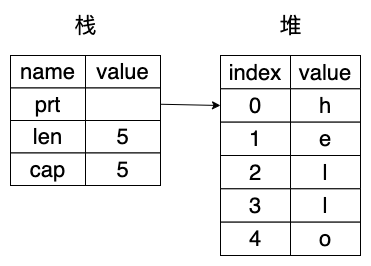

# 所有权

## 什么是所有权

无需垃圾回收即可保障内存安全.

所有运行的程序都必须管理其使用计算机内存的方式.

1. 具有垃圾回收机制,在程序运行时不断地寻找不再使用的内存
2. 程序员必须亲自分配和释放内存

Rust 则选择了第三种方式:通过所有权系统管理内存,编译器在编译时会根据一系列的规则进行检查.在运行时,所有权系统的任何功能都不会减慢程序.

## 栈（Stack）与堆（Heap）

栈和堆都是代码在运行时可供使用的内存,但是它们的结构不同.栈以放入值的顺序存储值并以相反顺序取出值,这也被称作后进先出.栈中的所有数据都必须占用已知且固定的大小.在编译时大小未知或大小可能变化的数据,要改为存储在堆上.堆是缺乏组织的:当向堆放入数据时,你要请求一定大小的空间.操作系统在堆的某处找到一块足够大的空位,把它标记为已使用,并返回一个表示该位置地址的指针,这个过程称作在堆上分配内存.因为指针的大小是已知并且固定的,你可以将指针存储在栈上.不过当需要实际数据时,必须访问指针.

入栈比在堆上分配内存要快,因为(入栈时)操作系统无需为存储新数据去搜索内存空间;其位置总是在栈顶.相比之下,在堆上分配内存则需要更多的工作,这是因为操作系统必须首先找到一块足够存放数据的内存空间,并接着做一些记录为下一次分配做准备.

访问堆上的数据比访问栈上的数据慢,因为必须通过指针来访问.在堆上分配大量的空间也可能消耗时间.

当你的代码调用一个函数时,传递给函数的值(包括可能指向堆上数据的指针)和函数的局部变量被压入栈中,当函数结束时,这些值被移出栈.

跟踪哪部分代码正在使用堆上的哪些数据,最大限度的减少堆上的重复数据的数量,以及清理堆上不再使用的数据确保不会耗尽空间,这些问题正是所有权系统要处理的.

所有权的存在就是为了管理堆数据.

## 所有权规则

1. Rust 中的每一个值都有一个被称为其所有者(owner)的变量
2. 值在任一时刻有且只有一个所有者
3. 当所有者(变量)离开作用域，这个值将被丢弃

## 变量作用域

```rust
{                      // s 在这里无效, 它尚未声明
    let s = "hello";   // 从此处起，s 是有效的
    // 使用 s
}                      // 此作用域已结束，s 不再有效
```

- 当 s 进入作用域时,它就是有效的
- 这一直持续到它离开作用域为止

## string 类型

前面介绍的类型都是存储在栈上的并且当离开作用域时被移出栈.

1. 字符串字面值 : 被硬编码进程序里的字符串值
2. 字符串类型 String : 类型被分配到堆上,所以能够存储在编译时未知大小的文本,可以使用 from 函数基于字符串字面值来创建 String

```rust
let mut s = String::from("hello"); // 这两个冒号(::)是运算符,允许将特定的 from 函数置于 String 类型的命名空间
s.push_str(", world!"); // push_str() 在字符串后追加字面值
println!("{}", s); // 将打印 `hello, world!`
```

为什么 String 可变而字面值却不行呢?区别在于两个类型对内存的处理上.

## 内存与分配

就字符串字面值来说,我们在编译时就知道其内容,所以文本被直接硬编码进最终的可执行文件中.使得字符串字面值快速且高效.这些特性都只得益于字符串字面值的不可变性.我们不能为了每一个在编译时大小未知的文本而将一块内存放入二进制文件中,并且它的大小还可能随着程序运行而改变.

对于 String 类型，为了支持一个可变，可增长的文本片段，需要在堆上分配一块在编译时未知大小的内存来存放内容.

- 必须在运行时向操作系统请求内存
- 需要一个当我们处理完 String 时将内存返回给操作系统的方法

1. 第一部分 : 当调用 String::from 时,它实现请求其所需的内存
2. 第二部分 : 实现起来就各有区别了,垃圾回收语言中 GC 记录并清除不再使用的内存,没有 GC 的话,识别出不再使用的内存并调用代码显式释放就是我们的责任了,跟请求内存的时候一样,如果忘记回收了会浪费内存,如果过早回收了,将会出现无效变量,如果重复回收,这也是个 bug 我们需要精确的为一个 allocate 配对一个 free

- 假如我们忘记释放内存,那么就会造成内存泄漏
- 假如我们过早地释放内存,那么就会产生一个非法变量
- 假如我们重复释放同一块内存,那么就会产生无法预知的后果

Rust 采取了一个不同的策略 : 内存在拥有它的变量离开作用域后就被自动释放.

```rust
{
    let s = String::from("hello"); // 从此处起，s 是有效的

    // 使用 s
}                                  // 此作用域已结束，
                                   // s 不再有效
```

当变量离开作用域,Rust 为我们调用 drop 函数,在这里 String 的作者可以放置释放内存的代码.Rust 在结尾的 } 处自动调用 drop.

### 变量与数据交互的方式(一): 移动

```rust
// 将 5 绑定到 x；接着生成一个值 x 的拷贝并绑定到 y
let x = 5;
let y = x;
```

```rust
let s1 = String::from("hello");
let s2 = s1; // 浅拷贝,指针指向地址不变
```

String 由三部分组成,这一组数据存储在栈上,指针指向地址则是堆上存放内容的内存

- 指向存放字符串内容内存的指针
- 长度 : 当前使用了多少字节的内存
- 容量 : 操作系统总共获取了多少字节的内存



这就有了一个问题:当 s2 和 s1 离开作用域,他们都会尝试释放相同的内存.这是一个叫做二次释放的错误.为了确保内存安全,Rust 则认为 s1 不再有效,不需要在 s1 离开作用域后清理任何东西.

```rust
let s1 = String::from("hello");
let s2 = s1;
println!("{}, world!", s1); // panic,禁止你使用无效的引用
```

拷贝指针、长度和容量而不拷贝数据可能听起来像浅拷贝,不过因为 Rust 同时使第一个变量无效了,这个操作被称为移动.

Rust 永远也不会自动创建数据的“深拷贝”.

### 变量与数据交互的方式(二): 克隆

```rust
let s1 = String::from("hello");
let s2 = s1.clone();
println!("s1 = {}, s2 = {}", s1, s2); // 堆上内存也会拷贝,s1,s2指针地址不一样
```

#### 只在栈上的数据：拷贝

```rust
let x = 5;
let y = x; // 像整型这样的在编译时已知大小的类型被整个存储在栈上,所以拷贝其实际的值是快速的
```

如果一个类型拥有 Copy trait,一个旧的变量在将其赋值给其他变量后仍然可用.任何简单标量值的组合可以是 Copy 的,不需要分配内存或某种形式资源的类型是 Copy 的.

- 所有整数类型
- 布尔类型
- 所有浮点数类型
- 字符类型
- 元组,当且仅当其包含的类型也都是 Copy 的时候

### 所有权与函数

向函数传递值可能会移动或者复制

```rust
fn main() {
    let s = String::from("hello");  // s 进入作用域
    takes_ownership(s);             // s 的值移动到函数里,后面不再有效.
    let x = 5;                      // x 进入作用域
    makes_copy(x);                  // x 应该移动函数里,但 i32 是 Copy 的,所以在后面可继续使用 x

} // x 先移出了作用域,然后是 s.但因为 s 的值已被移走,所以不会有特殊操作

fn takes_ownership(some_string: String) { // some_string 进入作用域
    println!("{}", some_string);
} // some_string 移出作用域并调用 `drop` 方法.占用的内存被释放

fn makes_copy(some_integer: i32) { // some_integer 进入作用域
    println!("{}", some_integer);
} // some_integer 移出作用域.不会有特殊操作
```

### 返回值与作用域

将值赋给另一个变量时移动它,当持有堆中数据值的变量离开作用域,其值将通过 drop 被清理掉,除非数据被移动为另一个变量.

```rust
fn main() {
    let s1 = gives_ownership(); // gives_ownership 将返回值移给 s1
    let s2 = String::from("hello");     // s2 进入作用域
    let s3 = takes_and_gives_back(s2);  // s2 被移动到takes_and_gives_back 中 它也将返回值移给 s3
} // s3 移出作用域并被丢弃,s2 也移出作用域,但已被移走,所以什么也不会发生,s1 移出作用域并被丢弃

fn gives_ownership() -> String {  // gives_ownership 将返回值移动给调用它的函数
    let some_string = String::from("hello"); // some_string 进入作用域.
    some_string                              // 返回 some_string 并移出给调用的函数
}

// takes_and_gives_back 将传入字符串并返回该值
fn takes_and_gives_back(a_string: String) -> String { // a_string 进入作用域
    a_string  // 返回 a_string 并移出给调用的函数
}
```

在每一个函数中都获取所有权并接着返回所有权

```rust
fn main() {
    let s1 = String::from("hello");
    let (s2, len) = calculate_length(s1);
    println!("The length of '{}' is {}.", s2, len);
}

fn calculate_length(s: String) -> (String, usize) {
    let length = s.len(); // len() 返回字符串的长度
    (s, length)
}
```

## 引用

引用允许你使用值但不获取其所有权.并不拥有这个值,当引用离开作用域时其指向的值也不会被丢弃.当函数使用引用而不是实际值作为参数,无需返回值来交还所有权.引用默认不允许修改引用的值.

```rust
fn main() {
    let s1 = String::from("hello");
    let len = calculate_length(&s1);
    println!("The length of '{}' is {}.", s1, len);
}

fn calculate_length(s: &String) -> usize {
    s.len()
}
```

### 可变引用

在特定作用域中的特定数据只能有一个可变引用,这个限制的好处是 Rust 可以在编译时就避免数据竞争.数据竞争会导致未定义行为,难以在运行时追踪,并且难以诊断和修复;Rust 避免了这种情况的发生,因为它甚至不会编译存在数据竞争的代码.

- 两个或更多指针同时访问同一数据
- 至少有一个指针被用来写入数据
- 没有同步数据访问的机制

```rust
fn main() {
    let mut s = String::from("hello");
    change(&mut s);
}

fn change(some_string: &mut String) {
    some_string.push_str(", world");
}
```

### 数据竞争

- 两个或两个以上的指针同时访问同一空间
- 其中至少有一个指针会向空间中写入数据
- 没有同步数据访问的机制

### 悬垂引用

在具有指针的语言中,很容易通过释放内存时保留指向它的指针而错误地生成一个悬垂指针.所谓悬垂指针是其指向的内存可能已经被分配给其它持有者.Rust 中编译器确保引用永远也不会变成悬垂状态:当你拥有一些数据的引用,编译器确保数据不会在其引用之前离开作用域.

### 引用的规则

- 在任意给定时间,要么只能有一个可变引用,要么只能有多个不可变引用
- 引用必须总是有效的

## 借用

我们将获取引用作为函数参数称为借用,

## slice

另一个没有所有权的数据类型是 slice,slice 允许你引用集合中一段连续的元素序列,而不用引用整个集合.

### 字符串切片

字符串切片是指向 String 对象中某个连续部分的引用.方括号中指定切片的范围区间`[starting_index..ending_index]`,其中的 starting_index 是切片起始位置的索引值,ending_index 是切片终止位置的下一个索引值.切片数据结构在内部存储了指向起始位置的引用和一个描述切片长度的字段,这个描述切片长度的字段等价于 ending_index 减去 starting_index.

```rust
let s = String::from("hello world");
let hello = &s[0..5]; // &s[..] 类型 &str
```

字符串切片的边界必须位于有效的 UTF-8 字符边界内.尝试从一个多字节字符的中间位置创建字符串切片会导致运行时错误.

字符串切片的类型写作&str.

```rust
let word = first_word(&s); // 不可变引用
s.clear(); // 需要传入可变引用,所以发生错误
```

### 字符串字面量就是切片

```rust
let s = "Hello, world!";
&str // 字符串切片
&String // 字符串引用
```

变量 s 的类型其实就是&str:它是一个指向二进制程序特定位置的切片.正是由于&str 是一个不可变的引用,所以字符串字面量自然才是不可变的.

### 其它类型切片

```rust
let a = [1, 2, 3, 4, 5];
let slice = &a[1..3]; // 切片类型是&[i32],内部存储了一个指向起始元素的引用及长度
```

## 自定义类型实现 Copy

```rust
// 要求所有字段都已实现 copy
#[derive(Copy, Clone)]
struct Data {
    a: i64,
    b: i64,
}
```

## copy 和 clone 区别

## 小结

- 栈中的数据都必须拥有一个已知且固定的大小.对于那些在编译期无法确定大小的数据,你就只能将它们存储在堆中.
